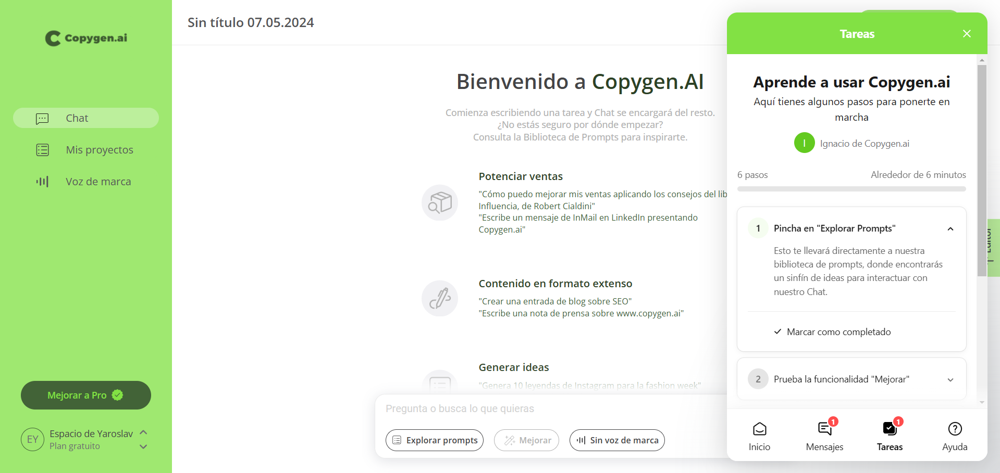
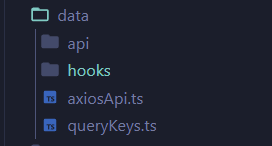

# Pentilo: Sample Next js project

## Description

The goal was to develop a marketing seo optimized website for a company that provides services in the field of crypto and fiat payments. The company can independently change the entire site content for two languages without the participation of developers since all information on the site is displayed through the CMS. The site also has integration with support chat, Calendly, and the client’s CRM system.

## Technology Stack

- @mui/material: React component library that allows for quick and convenient development of stylish user interfaces.
- next: React framework for building high-performance web applications.
- react-hook-form: Library for working with forms in React using hooks.
- @react-oauth/google: Library for implementing Google authentication in React applications.
- @tanstack/react-query: Library for managing state and caching HTTP requests in React applications, allowing efficient data handling and server requests.
- axios: Library for making HTTP requests in JavaScript, enabling convenient interaction with API servers.

## Examples of works

- [Authorization](#authorization)
- [An approach to using react-query with axios and react hooks](#an-approach-to-using-react-query-with-axios-and-react-hooks) 

## #An approach to using react-query with axios and react hooks

Using React-Query with Axios makes it easier to manage load and query errors by automatically caching data and optimizing queries. Creating intermediate Hooks allows you to abstract query logic, making your code cleaner and more reusable. As a result, it makes development easier and improves application performance.

Structure:
 


- api: Creating a separate folder called "api" for managing Axios requests adds structure and cleanliness to the code.
- hooks: Creating a separate folder called "hooks" for managing React-Query and Axios queries adds elegance and organization to your project. This folder can contain intermediate hooks that combine logic for query execution, statefulness, and error handling.
- axiosApi.ts: This file configures the Axios instance to interact with the API. The base URL, request timeout, and headers are set. Interspersers are also used to log sent requests and received responses, which makes it easier to debug and debug network requests in the application.
- queryKeys.ts: The queryKeys.ts file contains constants for the keys used to identify data in the cache when using React-Query Hooks. Using these constants avoids magic strings in your code, making it easier to manage keys and keeping your code clean and readable.

Example api call:

```
import axiosApi from '@/data/axiosApi'
import { ITransactionParams } from './api.types'

export const getTransaction = async (params: ITransactionParams) =>
  axiosApi.get('/transactions', { params }).then((res) => res.data)
```

Example hook:

```
import { useQuery } from '@tanstack/react-query'
import { ITransactionParams } from '@/data/api/api.types'

export const useTransaction = (params: ITransactionParams) => {
  const { maxPrice, minPrice, status, startDate, endDate, ...otherParams } =
    params
  return useQuery<ITransaction>({
    queryKey: [transactionKeys.list(otherParams)],
    queryFn: () => getTransaction(params)
  })
}
```

Use hook:

```
import { useDebounce } from 'use-debounce'
import { useState } from 'react'

const [address, setAddress] = useState<string[]>([])
const [status, setStatus] = useState<string[]>([])
const [price, setPrice] = useState<[string, string]>(['0', '0'])
const [skip, setSkip] = useState<number>(0)
const [take, setTake] = useState<number>(10)
const [searchDebounce] = useDebounce(search, 1000)
const [addressDebounce] = useDebounce(address, 1000)

const transactionData = useTransaction(
    {
      search: searchDebounce || undefined,
      take,
      status: status.length ? status : undefined,
      skip,
      address: addressDebounce.length ? address : undefined,
      startDate: date[0] ? date[0].toISOString() : undefined,
      endDate: date[1] ? date[1].toISOString() : undefined,
      maxPrice: +price[1] ? +price[1] : undefined,
      minPrice: +price[0] ? +price[0] : undefined,
    }
  )
```

## #Authorization

We employ two distinct methods for user registration in our application: firstly, the conventional login form using email and password, allowing users to create accounts and sign in with a unique identifier and password; secondly, Google authentication, enabling users to utilize their Google accounts for swift and convenient access without the need to create a separate account within our system.

#### Google Auth:

Example hook google:

```
import { IPostAuthSignUpSuccessData } from '@/data/api/api.types'

export const useAuthGoogle = () =>
  useMutation<IPostAuthSignUpSuccessData>({
    mutationFn: (data) => postAuthGoogle(data),
  })
```

Example Google Button:

```
import { useGoogleLogin } from '@react-oauth/google'

const GoogleButton = ({
  text,
  inviteToken,
  ...otherProps
}: {
  text: string
  inviteToken?: string
}) => {
  const { storedValue } = useLocalStorage('onboardingComplete', false)

  const {
    mutate: mutateAuthGoogle,
    data,
    isSuccess: isSuccessAuthGoogle,
  } = useAuthGoogle()

  const googleLogin = useGoogleLogin({
    onSuccess: async ({ code }: { code: string }) => {
      mutateAuthGoogle({ code, invitationToken: inviteToken })
    },
    flow: 'auth-code',
  })

  if (isSuccessAuthGoogle && data.subscription && data.subscription.isActive)
    redirect(NAV_LINKS.TRANSACTIONS)

  if (isSuccessAuthGoogle && !data.subscription)
    redirect(NAV_LINKS.BUY_SUBSCRIPTION)

  return (
    <Box
      {...otherProps}
      onClick={googleLogin}
    >
      {text}
      <Image src={googleIcon} alt='GoogleIcon' />
    </Box>
  )
}
```
